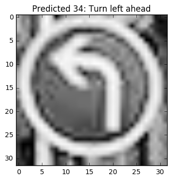

# **Traffic Sign Recognition**

---

**Build a Traffic Sign Recognition Project**

The goals / steps of this project are the following:
* Load the data set (see below for links to the project data set)
* Explore, summarize and visualize the data set
* Design, train and test a model architecture
* Use the model to make predictions on new images
* Analyze the softmax probabilities of the new images
* Summarize the results with a written report

## Rubric Points
### Here I will consider the [rubric points](https://review.udacity.com/#!/rubrics/481/view) individually and describe how I addressed each point in my implementation.  

---
### Writeup / README

#### 1. Provide a Writeup / README that includes all the rubric points and how you addressed each one. You can submit your writeup as markdown or pdf. You can use this template as a guide for writing the report. The submission includes the project code.

You're reading it! and here is a link to my [github repo](https://github.com/fasouto/CarND-Traffic-Sign-Classifier-Project)

### Data Set Summary & Exploration

#### 1.Provide a basic summary of the data set and identify where in your code the summary was done. In the code, the analysis should be done using python, numpy and/or pandas methods rather than hardcoding results manually.

The code for this step is contained in the second code cell of the IPython notebook.  

I used numpy to calculate summary statistics of the traffic
signs data set:
* The size of training set is 34799
* The size of test set is 12630
* The shape of a traffic sign image is (32, 32, 3)
* The number of unique classes/labels in the data set is 43

####2. Include an exploratory visualization of the dataset and identify where the code is in your code file.

The code for this step is contained in the third code cell of the IPython notebook.  

I decided to visualize the frequencies of each signal in the training, testing
and validation set.

I also decide to display an example of each signal, for reference and to get a
feel of the dataset.

### Design and Test a Model Architecture

#### 1. Describe how, and identify where in your code, you preprocessed the image data. What tecniques were chosen and why did you choose these techniques? Consider including images showing the output of each preprocessing technique. Pre-processing refers to techniques such as converting to grayscale, normalization, etc.

This part took a long time, for reference I kept some of the filters and modifications that I tried on the images.

My first choice was to grayscale and normalize as described in the reference paper, both methods give me good results. The normalization was in the range [0, 1].

Since some of the images were very noisy I tried to remove noise from the image with [`fastNlMeansDenoisingColored`](http://docs.opencv.org/3.0-beta/modules/photo/doc/denoising.html) but it was so slow that became unusable.

Then I guess that since the signals are easy to recognize symbols I should try to identify the shapes in them, so I tried to detect edges. Both canny detection and the laplacian derivative didn't worked well.

Converting to different color spaces to get rid of brightness didn't improve the results.

At last I improve the contrast with CLAHE (Contrast Limited Adaptive Histogram Equalization) equalization and the model improve to ~93%.

Here is an example of a traffic sign image before and after the preprocessing.

#### 2. Describe how, and identify where in your code, you set up training, validation and testing data. How much data was in each set? Explain what techniques were used to split the data into these sets. (OPTIONAL: As described in the "Stand Out Suggestions" part of the rubric, if you generated additional data for training, describe why you decided to generate additional data, how you generated the data, identify where in your code, and provide example images of the additional data)

I was running out of time so I don't generate additional images. I wanted to rotate some of them.

I don't understand this question or I must did something wrong, to load the train, testing and validation I simply load the files in `/data` at the beginning of the notebook. I used the `train.p`, `valid.p` and `test.p` files.

#### 3. Describe, and identify where in your code, what your final model architecture looks like including model type, layers, layer sizes, connectivity, etc.) Consider including a diagram and/or table describing the final model.

Basically the topology is the same as Lenet but I added dropout to prevent overfitting. I experiment adding more layers and changing the size and padding but I got worse results all the time.

My final model consisted of the following layers:

| Layer         		|     Description	        					|
|:---------------------:|:---------------------------------------------:|
|Convolution layer| Input = 32x32x1. Output = 28x28x6|
|Activation||
|Pooling layer| Input = 28x28x6 Output = 14x14x6|
|Convolution layer| Input=14x14x6 Output = 10x10x16|
|Activation||
|Pooling layer| Input = 10x10x16 Output = 5x5x16|
|Flatten layer| Input = 5x5x16 Output = 400x1|
|Fully Connected layer| Input = 400 Output = 120|
|Activation||
|Fully Connected layer| Input = 120 Output = 84|
|Activation||
|Fully Connected layer| Input = 84 Output = 43|

#### 4. Describe how, and identify where in your code, you trained your model. The discussion can include the type of optimizer, the batch size, number of epochs and any hyperparameters such as learning rate.

The code for training the model is located in the cells 9 and 11 of the ipython notebook.

The cell #9 contains the hyperparameters, which are the same as the Lenet example plus an `KEEP_PROB` which holds the probabilities for the dropout.

As expected increasing the learning rate decrease significantly the accuracy of the model, however surprisingly(for me) decreasing this value didn't improve the model even incrementing the number of epochs.

The number of epochs was set to 25 because adding more didn't improve the model.

#### 5. Describe the approach taken for finding a solution. Include in the discussion the results on the training, validation and test sets and where in the code these were calculated. Your approach may have been an iterative process, in which case, outline the steps you took to get to the final solution and why you chose those steps. Perhaps your solution involved an already well known implementation or architecture. In this case, discuss why you think the architecture is suitable for the current problem.

My final model results were:
* training set accuracy of 0.997
* validation set accuracy of 0.935
* test set accuracy of 0.921

I choose Lenet, because it was tested to be good and I'm still new with these techniques. Also it was suggested in the same notebook, so I just changed the input layer to accept grayscale images and the output layer to the same size as the length of the dataset.

I also tried to apply the same architecture as the Sermanet paper with multi scale features, but the lack of experience with deep learning/tensorflow delayed me a lot.

###Test a Model on New Images

#### 1. Choose five German traffic signs found on the web and provide them in the report. For each image, discuss what quality or qualities might be difficult to classify.

Here are five German traffic signs that I found on the web:

The first image might be complex because is sightly on the side and not perfecly cropped. Same for the 5th image.

Images number two and four are not new and have some marks.

Some images are too big and others small, let's see how they deal with it.

#### 2. Discuss the model's predictions on these new traffic signs and compare the results to predicting on the test set. Identify where in your code predictions were made. At a minimum, discuss what the predictions were, the accuracy on these new predictions, and compare the accuracy to the accuracy on the test set (OPTIONAL: Discuss the results in more detail as described in the "Stand Out Suggestions" part of the rubric).

The code for making predictions on my final model is located in the cell 14 of the Ipython notebook.

Here are the results of the prediction:

| Image			        |     Prediction	        					|
|:---------------------:|:---------------------------------------------:|
| Road work      		| Road work   									|
| Right of way     			| Right of way 										|
| Bumpy road					| Wild animals crossing											|
| 100 km/h	      		| 120 km/h					 				|
| Yield			| Yield      							|
| Turn left ahead			| Turn left ahead      							|

The model calculated 4/6 images right, that is roughly a 66% of them. This is way worse than the test set. Looking at the histogram with the frequencies of signals there are not a lot of "Bumpy road" signals so this may be the problem.
However there are lots of images in the dataset of 100 km/h and it's confusing it with 120 km/h. Maybe because the shapes are similar, it just changes a number.

#### 3. Describe how certain the model is when predicting on each of the five new images by looking at the softmax probabilities for each prediction and identify where in your code softmax probabilities were outputted. Provide the top 5 softmax probabilities for each image along with the sign type of each probability. (OPTIONAL: as described in the "Stand Out Suggestions" part of the rubric, visualizations can also be provided such as bar charts)

The code for making predictions on my final model is located in the 30th cell of the Ipython notebook.

Here are the probabilities of each image:

Nothing important on the first two images.

For some reason the probability of 7 (100 km/h) was very low for this one, not even close.

I was surprised with the yield prediction, the signal is on the side and the picture is not very good.

The bumpy road sign was the one with the worst results by far, shoudl be 22. But it has veryt low probability. Signals 20 and 31 are not similar to this, I don't know what's happening here. Maybe too little data.

